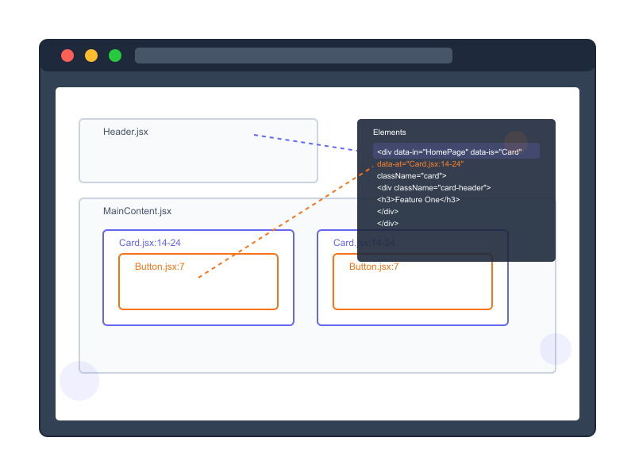
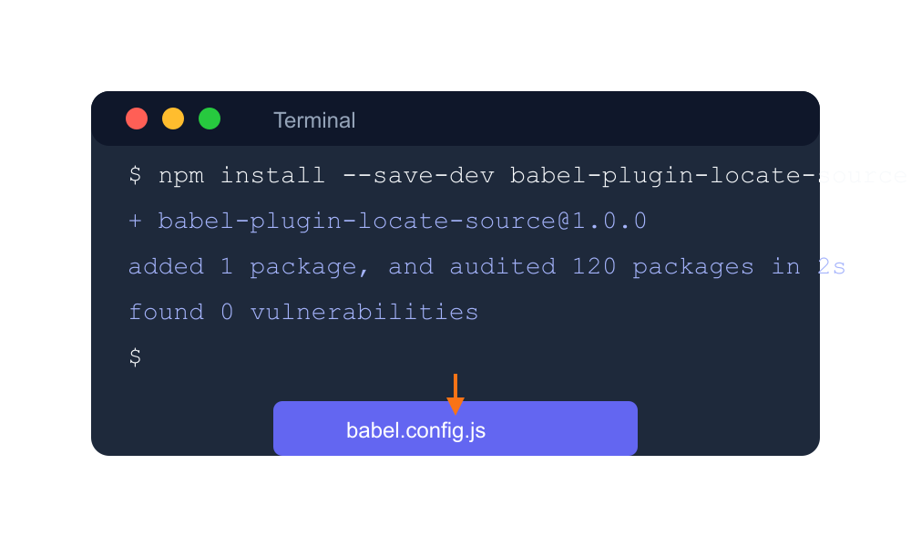
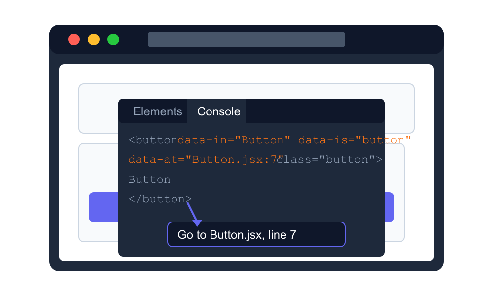

<div align="center">
  
  <h1>babel-plugin-locate-source</h1>
  <p>Easily locate your React components in the DOM with source file and line information</p>
  <hr />
  
  [](https://www.npmjs.com/package/babel-plugin-locate-source)
  [](https://opensource.org/licenses/MIT)
</div>

## 🔍 What It Does

When enabled, this plugin adds the following HTML attributes to JSX elements in development mode:

- `data-at`: The source file and line numbers (e.g., "Button.tsx:42-45")
- `data-is`: The component name (e.g., "Button")
- `data-in`: The parent component where this JSX appears (e.g., "Header")

<div align="center">
  
</div>

## 🚀 Installation

```bash
npm install --save-dev babel-plugin-locate-source
# or
yarn add --dev babel-plugin-locate-source
```

### For Vite + React Projects

Update your `vite.config.js`:

```js
import react from "@vitejs/plugin-react";
import { defineConfig } from "vite";
// https://vite.dev/config/
export default defineConfig({
  // ..rest of your config,
  plugins: [
    // ...rest of your plugins
    react({
      
      babel: {
        plugins: [
          [
            /**
             * the plugin, by default, is enabled if
             * 
             * process.env.NODE_ENV === 'development'
             * 
             * you can pass the enabled parameter to fit your custom rules
             */
            "babel-plugin-locate-source",
            { enabled: true },
          ],
        ],
      },
    }),
  ],
});
```

### Alternative: Using `.babelrc` or `babel.config.js`

Create or update your `.babelrc` file:

```json
{
  "presets": ["next/babel"],
  "env": {
    "development": {
      "plugins": [
        "babel-plugin-locate-source"
      ]
    }
  }
}
```

Or use a `babel.config.js` file:

```js
// babel.config.js
module.exports = {
  presets: ["next/babel"],
  plugins: [
    /**
     * the plugin, by default, is enabled if
     * 
     * process.env.NODE_ENV === 'development'
     * 
     * you can pass the enabled parameter to fit your custom rules
     */
    ["babel-plugin-whereis", { enabled: true }]
  ]
};
```

> **⚠️ WARNING**: Using a `babel.config.js` file with Next.js will disable the SWC compiler

## ⚡ Step-by-Step Integration

<div align="center">
  
  
  
</div>

1. **Install the plugin** using npm or yarn
2. **Update your Babel configuration** to include the plugin
3. **Start your development server** and inspect elements to see source information

## ⚙️ Next.js Compatibility

When using this plugin with Next.js, be aware that it will disable the [SWC compiler](https://nextjs.org/docs/architecture/nextjs-compiler) in favor of Babel. This is a necessary trade-off to enable the source location features.

## 🛠️ Configuration

The plugin accepts the following options:

```js
{
  "enabled": true // Defaults to true if process.env.NODE_ENV is "development"
}
```

You can configure the plugin in your Babel configuration:

```json
{
  "plugins": [
    ["babel-plugin-locate-source", {
      "enabled": true
    }]
  ]
}
```

## ✨ Features

- ✅ Only adds attributes in development mode by default
- ✅ Skips node_modules files
- ✅ Provides file path, line numbers, component name, and parent component info
- ✅ Automatically disabled in production builds
- ✅ Zero runtime performance impact in production

## 🔧 How It Helps

When inspecting your application in the browser's devtools, you'll see:

```html
<div data-in="HomePage" data-is="Card" data-at="ProductCard.tsx:12-35">
  <!-- Your component content -->
</div>
```

This makes it much easier to:

1. Identify which component is rendering what markup
2. Locate the exact file and line number where the component is defined
3. Understand component hierarchy and nesting relationships

<div align="center">
  
</div>

## 📝 Example

Original JSX:
```jsx
// src/components/Button.jsx
export const Button = ({ children, ...props }) => {
  return <button className="my-button" {...props}>{children}</button>
}
```

Resulting HTML (in dev mode):
```html
<button data-in="Button" data-is="button" data-at="Button.jsx:3" class="my-button">
  Click me
</button>
```

## 📜 License

MIT

## 🧑‍💻 Development

If you want to contribute to this project, you can follow these steps:

1. Clone the repository
2. Install dependencies with `npm install`
3. Run tests with `npm test`
4. Make your changes
5. Build the package with `npm run build`

### Building

The build process uses Rollup to create optimized CommonJS and ES Module versions of the plugin. To build the package:

```bash
npm run build
```

This creates:
- `dist/index.js` - CommonJS module for Node.js environments
- `dist/index.esm.js` - ES module for bundlers like webpack, Rollup, etc.

